I recently went off on an exploration of generating images and art using AI, specifically generative adversarial networks (GANs).  This was first inspired by a twitter feed, https://twitter.com/images_ai?lang=en, where they provide a nice Google Colab notebook.

This method is based on text-to-image translation, so the generated art is seeding by text prompts.  The image can be gnereated starting with some random image, but also can use a seed image to guide the art.

The specific approach is "VQGAN+CLIP", which I haven't delved too deeply into, but is a text-to-image model that can produce very high resolution outputs.  More details here https://alexasteinbruck.medium.com/vqgan-clip-how-does-it-work-210a5dca5e52

So I began playing around with the CoLab notebook, here's a few fun explorations:

## MRI Spaceship

In these examples, I used a random image seed, with the prompt "MRI Spaceship".  The difference is based on the image training data (Wikiart versus ImageNet)

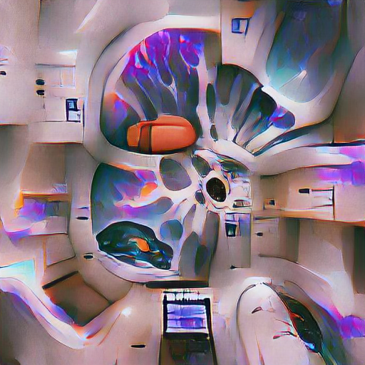

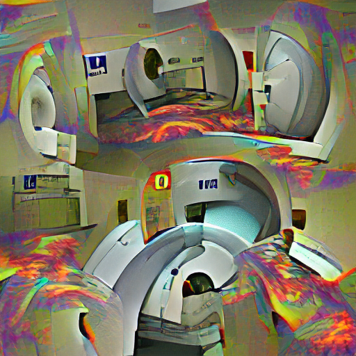

## Seeding with MRIs - Hyperpolarized Brain

Then, I tried started with this seed image

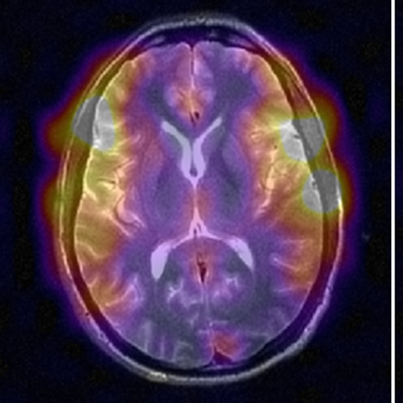

And the prompt "MRI Spaceship".  The image evolved as

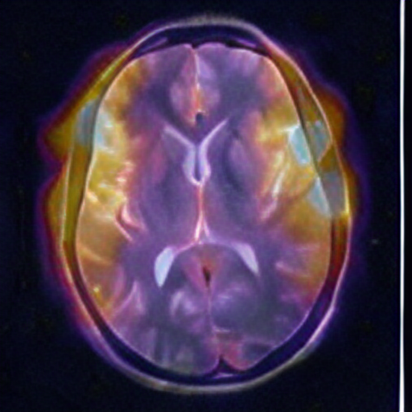
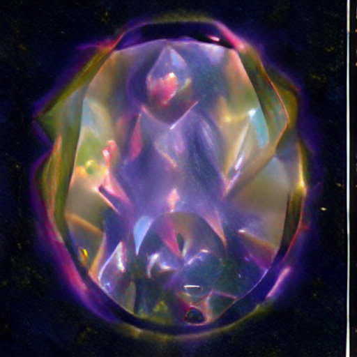
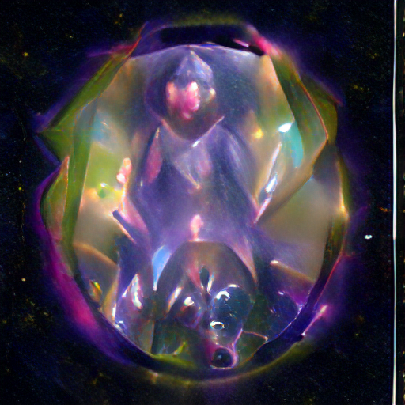
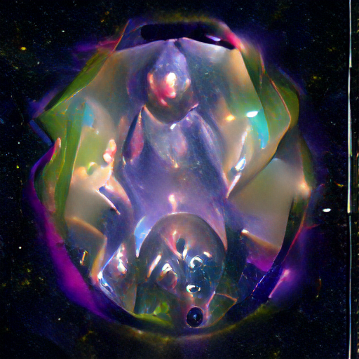
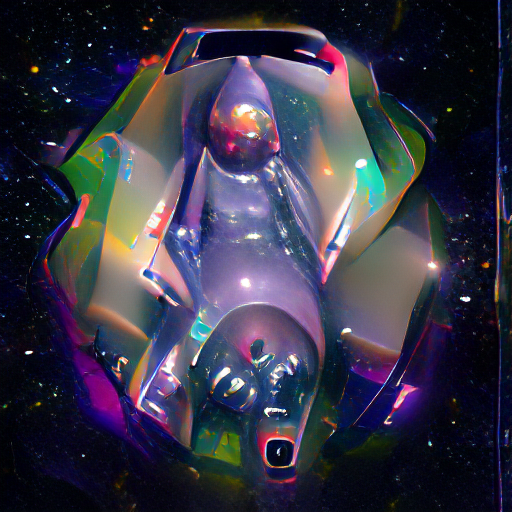

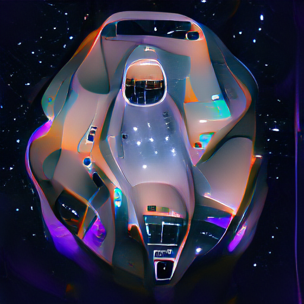

I also tried with a prompt of something like "Moon | Volcano", but using WikiArt training:

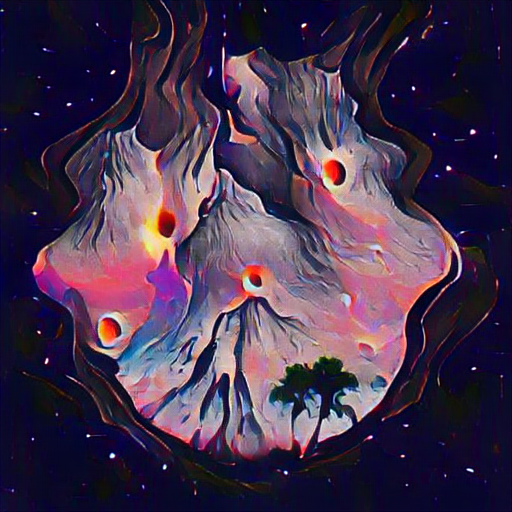

## Seeding with MRIs - Prostate Diffusion

This was getting fun, so I started with this seed image of a prostate diffusion weighted image:

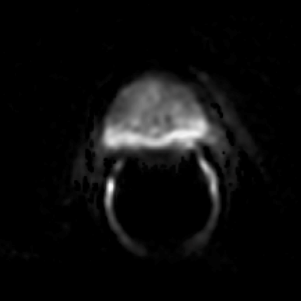

**"The moon has roots"**

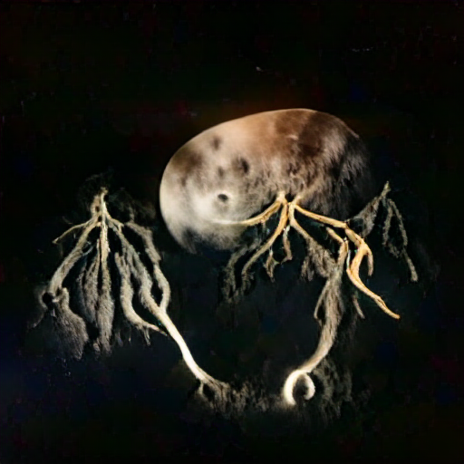

**"The moon has roots"**

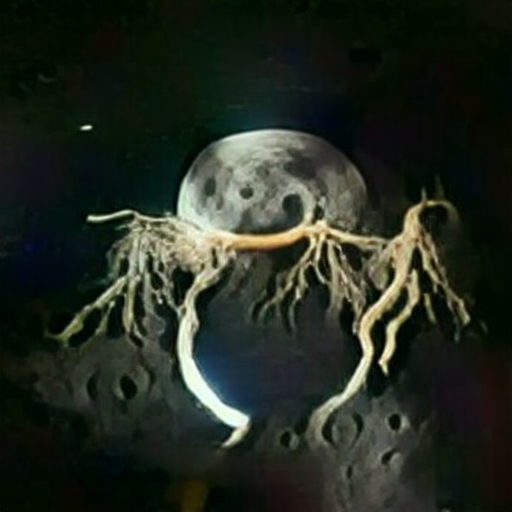

**"Moon Carrot"**

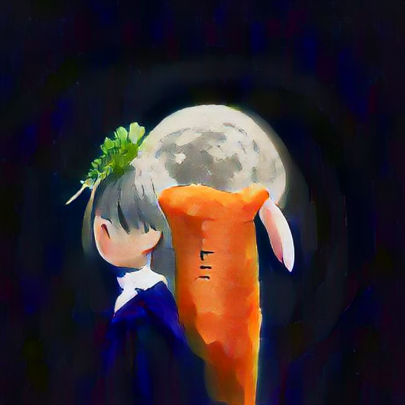

**"Vegetables Under the Moon"**

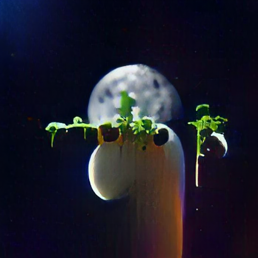
