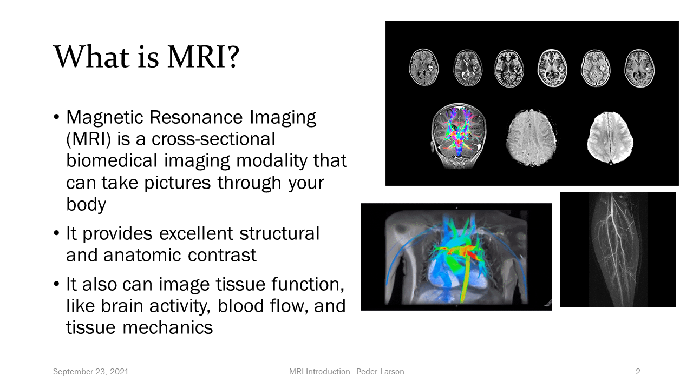
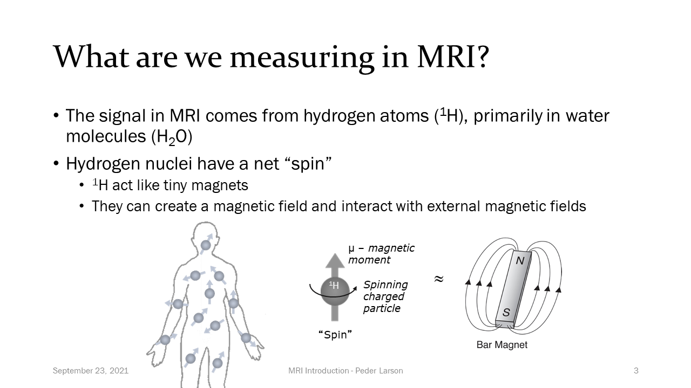
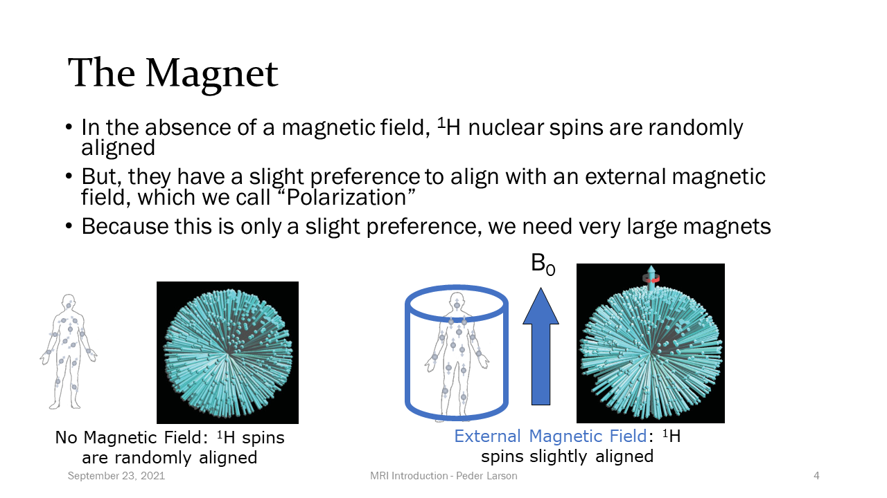
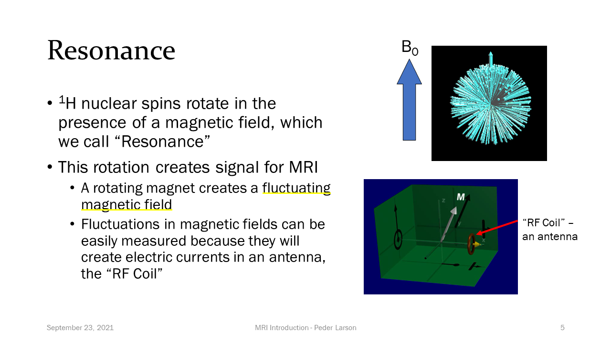
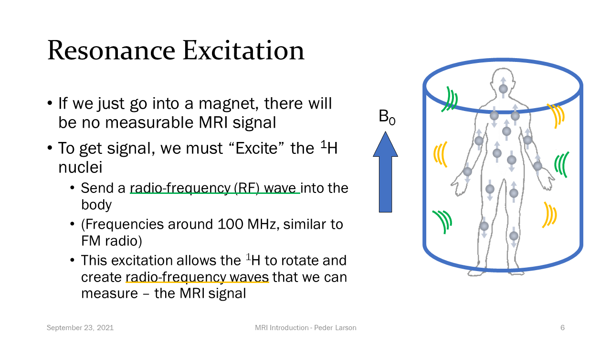
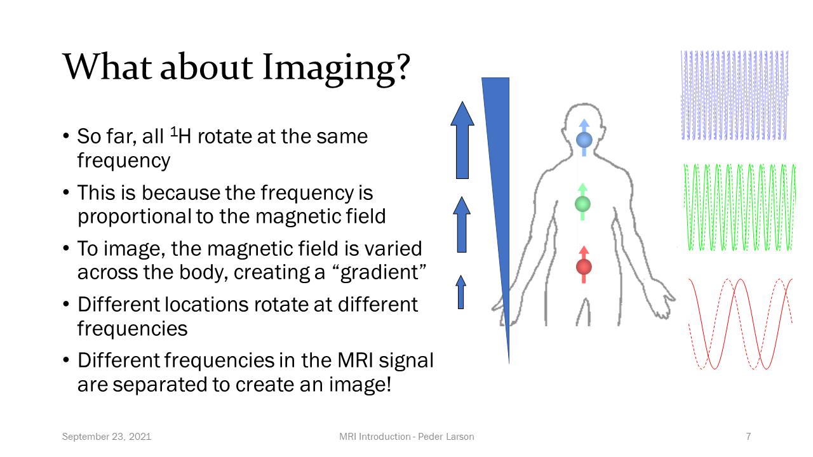
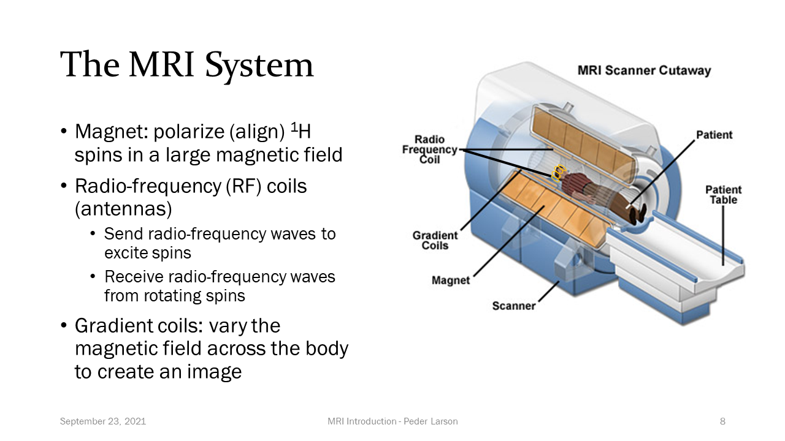
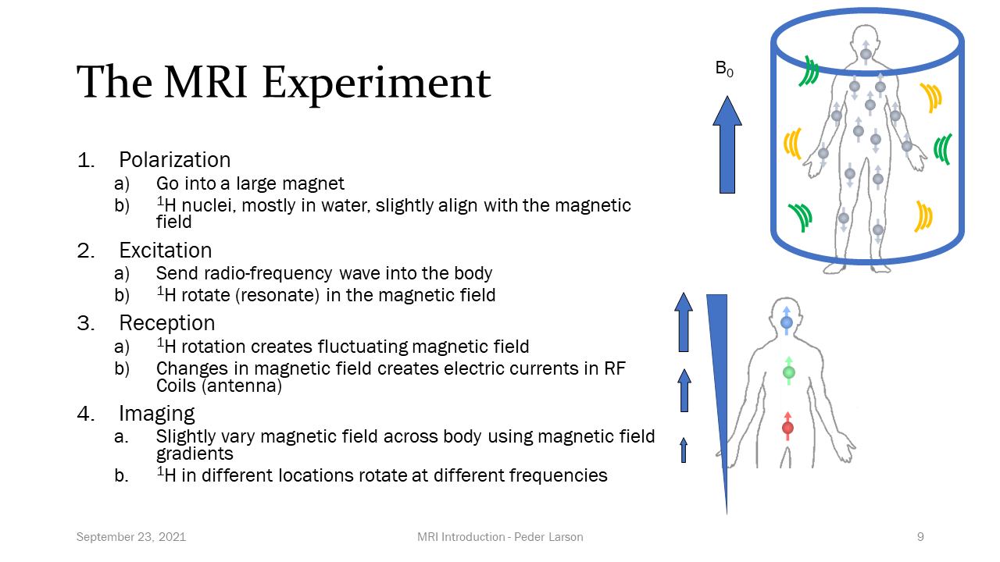
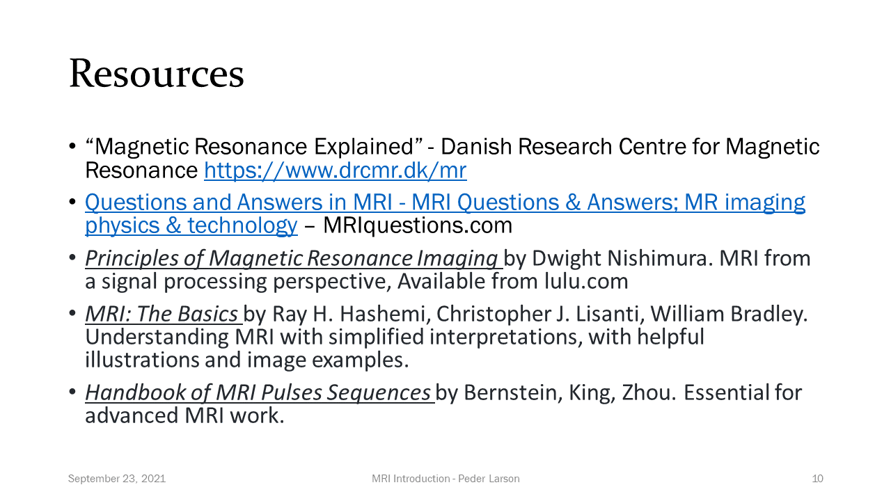

I recently embarked on my 11th(!) year of teaching UCSF Biomedical Imaging 201: "Principles of MRI" this fall, where I always start with an Overview of MRI.  I think this is a tough lecture, especially since I was throwing a lot of different physics, system design, and concepts into one lecture.

I also struggle with teaching a subject that I have so much experience with.  I am too used to the jargon, the assumptions, and can be disconnected from the foundational understanding.  As I update my lectures, I try to take this perspective to heart, being as explicit as possible with concepts, notation, jargon, etc.

This year I thought I could improve my teaching by challenging myself to make a **brief** introduction to MRI video for my students to watch before the first class.  This would give students some basic idea of how MRI works coming into the course, so they are not totally overwhelmed.  It also would force me to constrain my explanations to fundamental concepts that can be quickly communicated.

I originally gave myself a budget of 30 minutes for explanations, but was rather proud of myself when I ended up with a less than 10 minute explanation.  I haven't watched it too much (still hard to watch myself in videos), but if felt pretty good in recording it, which I hope comes across.

## How MRI Works - explained in under 10 minutes



<!-- **VIDEO** https://youtu.be/1Ku6-uXw7Ag -->

### Slides

