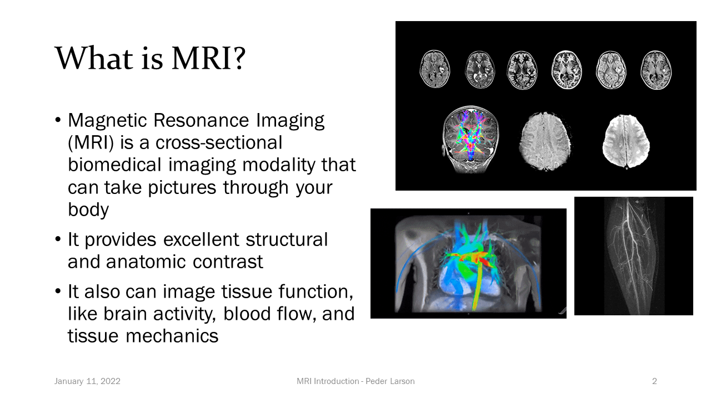

In Radiation Oncology, photons, protons, or electrons are used to treat cancer. Medical imaging is crucial in this process and allows us to visualize a patient’s tumor and healthy organs. The most common type of imaging used in radiation oncology is a computed tomography (CT) scan because it provides both anatomical information and a map of photon attenuation, which is necessary for calculating the dose delivered by the radiation. However, magnetic resonance imaging (MRI) is an exceptionally powerful imaging modality that can provide very helpful information like excellent soft tissue contrast and functional information about tumor behavior. Therefore, MRI is becoming a very popular imaging choice in radiation oncology clinics.

Links

[Principles of MRI Recorded Lectures](https://www.youtube.com/playlist?list=PLjBt5Iq93BT9eXMsgevVTXKVv4BgVLB1X)

Graphics example - upload image in the assets/images/ folder

